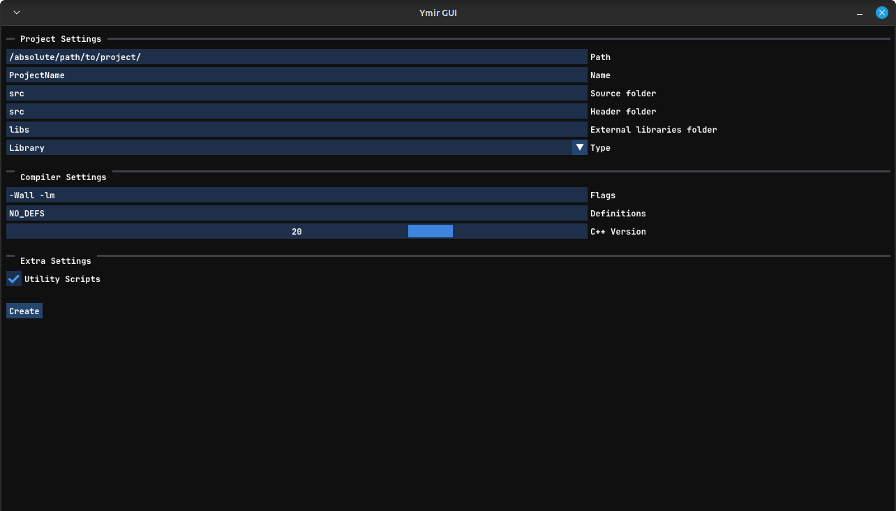

# What is Ymir?
Ymir is a C++ project generator much like what Visual Studio has. However, unlike VS, Ymir is more Linux-based and is much more simple and lightweight. Or, rather, less robust in its features compared to VS. You can use the CLI version or the GUI version of Ymir, both providing the same functionality but just in a different visual aspect. Ymir is by no means a replacement for managing your C++ projects. Far from it. It will only help you in the initial stage of starting a new C++ project. It will help you set up the necessary folders and files to *immediately* start programming in God's language. You don't have to go fiddling around trying to create multiple folders, name them, and all that nonsense. Just tell Ymir where to dump all of your emotional thoughts and rage (the main directory) and it will do its job by creating a build folder, a source folder, a dependencies folder, and any other extra directories you specified.  

Ymir will also create a simple 'main.cpp' file and a *very* simple 'CMakeLists.txt' file. For now, Ymir only supports CMake as your project's build system. However, in the future, Ymir will include other build systems like Make or PreMake. Ymir will also create a 'build_and_run.sh' shell script to easily build and compile your program. You can tell Ymir to not generate scripts as it will do it by default. Do keep in mind that the shell script Ymir will generate will have to be converted (or chmod'd) by you in order to be executed.

Ymir has many settings you can set to create the *exact* project you want. For example, with Ymir, you can specify the C++ version, whether the project is a program (an executable) or a library, add compiler flags easily, add definitions, and more. 

# Build
Currently, Ymir only supports Linux. Why? Because I'm a neckbeard. If you have any complaints, please insert them into the I-don't-give-a-fuck machine. Thank you. 

Jokes aside, the process of building Ymir is straightforward. However, it does differ from version to version. For example, Ymir-CLI does not have any external dependencies and will build the fastest. On the other hand, Ymir-GUI does use ImGui and GLFW. Now, the only dependency you have to worry about is GLFW. ImGui is internally included and built by Ymir. But you can use whatever version you like.

There is one process that both versions do share, however, and that is cloning the project.  

~~~
git clone https://github.com/MohamedAG2002/Ymir.git
cd Ymir
~~~

Sadly, that is where the similarities end. Below you'll find the build instructions for both versions.

## CLI: How To Build? 
Building Ymir-CLI is very simple. First, you'll have to navigate to wherever you cloned Ymir and then run the commands below:

~~~
mkdir build
cd build 
cmake ..
make 
~~~

After successfully building Ymir, you can use just use the executable that was just produced. However, you can also run the command below to make Ymir a global CLI command so that you can use it in any directory. 

~~~
sudo make install
~~~

## GUI: How To Build? 
As for the GUI version of Ymir, there's a little bit of work on your end. Specifically, you need to get GLFW as Ymir depends on it to create a window and such. Ymir also use GLAD and ImGui but you don't have to worry about those since Ymir handles them for you. Once you've installed GLFW and put it somewhere CMake can find, you only have to build Ymir and cross your fingers that nothing happens. If you get any linking errors make sure that you linked GLFW correctly and that CMake found it in the first place. However, if there are any issues then you can contact me directly on here or anywhere else I'm available. The same commands for compiling the CLI version should work for the GUI version as well.

# Uses
As mentioned before, Ymir has two versions you can use: the CLI version and the GUI version. Both offer the same functionality but both differ in visual terms. You can use either. Whatever suits you best. However, do keep in mind that the GUI version is naturally more bloated since it has to deal with GLFW, ImGui, and OpenGL. So if you do prefer something more lightweight but a little bit harder to work with then use the CLI version. But if you don't mind being a little heavy then use the GUI version. Below are examples of both versions.

## CLI: How to Use? 
In order to create a project with Ymir-CLI, there are two *very* essential and *very* important values you need to pass. The path of the project and the name of the project. Any other commands that Ymir provides are optional and Ymir will just use the default values for these optional commands if none of them are given. Do note that with both versions, Ymir will create a root directory with the name of the project in the provided path. So you don't need to do something like `ymir ~/C++Projects/NewProject NewProject`. Ymir will go to that path and create a new directory for you. No need to create one on your own. Another thing to note, Ymir will keep the header files (.h/.hpp) of the project in the same directory as the source files (.cpp). If you don't like that, you can use one of those optional commands mentioned above to specify a specific folder for the header files.

### List of all CLI commands

~~~
 --src     -S = Folder to hold all of the .cpp files (default = src)"
 --header  -H = Folder to hold all of  the .h/.hpp files (default = src)
 --deps    -L = Folder to hold all external dependencies (default = libs)
 --scripts    = Should this project have utility scripts? (0 = yes, 1 = no)
 --cpp     -V = C++ version this project will use (default = 17)
 --flags   -F = Extra compiler flags (NOTE: put the falgs inside \"\")
 --defs    -D = Extra project definitions (NOTE: put the defs inside \"\")
 --type    -T = Type of this project (PROJ_TYPE_EXEC or PROJE_TYPE_LIB; default = PROJ_TYPE_EXEC)
~~~

## CLI: Example

~~~
# A very basic use case 
ymir /home/ymir-dev/Dev/C++ new_project
~~~

~~~
# Specifying some extra commands 
ymir /home/ymir-dev/Dev/C++ new_project --cpp 20 --type PROJ_TYPE_LIB --flags "-Wall -lm" --defs "GLFW_INCLUDE_NONE OTHER_DEF"
~~~

## GUI: How to Use? 
The GUI version is the simplest to use. After you have compiled and built Ymir-GUI successfully, you should be able to run the `ymir-gui` executable produced and a window should popup with a very simple UI. That's all the UI Ymir offers at the moment. Perhaps there could be extra functionality in the future. But, for now, that is all that is available. Below you can see a picture of the UI.

## GUI: Example  

As you can see, the UI is very simple and does not really have any hidden functionality. What you see is what you get. However, please make sure that you input the correct path and make sure to read the instructions given on the tooltips if you are ever confused. If you hover over any of the options/inputs you should see a note telling you what to input and what remarks you should know about.
